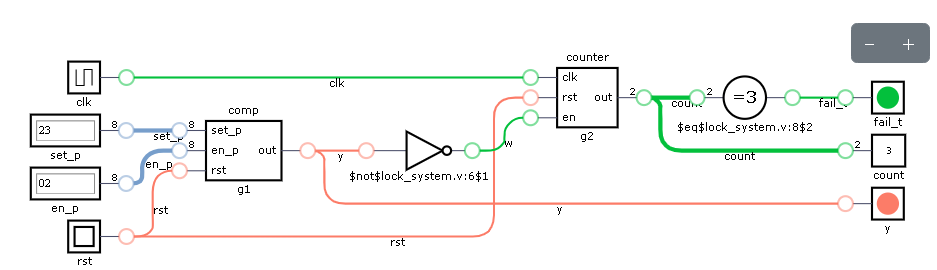

# 🔐 Lock System Simulation Results

## Overview

This simulation verifies the functionality of a digital password-based lock system. The design checks whether the entered password matches the stored password, counts incorrect attempts, generates a failure flag after multiple wrong attempts, and unlocks the system only when the correct password is entered.

---

## Stored Password

```text
set_p = 10101010
```

---

## Simulation Output Summary

| Time (ns) | Reset (`rst`) | Entered Password (`en_p`) | Unlock (`y`) | Wrong Count | Fail Flag | Description |
|-----------|---------------|---------------------------|--------------|-------------|-----------|-------------|
| 0 | 1 | 00000000 | 0 | X | X | Simulation starts. Internal registers are uninitialized. |
| 5 | 1 | 00000000 | 0 | 0 | 0 | Reset initializes the system. |
| 15 | 0 | 00000000 | 0 | 1 | 0 | First incorrect password attempt. |
| 25 | 0 | 11110000 | 0 | 2 | 0 | Second incorrect password attempt. |
| 35 | 0 | 11110000 | 0 | 3 | 1 | Third incorrect attempt. Failure flag is asserted. |
| 45 | 0 | 10101010 | 1 | 0 | 0 | Correct password entered. Lock unlocks and counter resets. |
| 65 | 0 | 00001111 | 0 | 0 | 0 | New incorrect password sequence begins. |
| 75 | 0 | 00001111 | 0 | 1 | 0 | Wrong attempt counter increments. |
| 85 | 0 | 10101010 | 1 | 2 | 0 | Correct password unlocks the system. |
| 95 | 0 | 10101010 | 1 | 0 | 0 | System remains unlocked with correct password. |
| 125 | 1 | 10101010 | 0 | 0 | 0 | Reset is asserted. System returns to initial state. |
| 135 | 0 | 10101010 | 1 | 1 | 0 | Correct password entered after reset. |
| 145 | 0 | 10101010 | 1 | 0 | 0 | Lock remains unlocked. Simulation completes successfully. |

---

# Functional Verification

## ✅ Test Case 1 – Reset Verification

**Objective**

Verify that asserting the reset signal initializes the system.

**Expected Result**

- Lock remains locked.
- Wrong attempt counter resets to zero.
- Failure flag is cleared.

**Result**

**PASS ✅**

---

## ✅ Test Case 2 – Incorrect Password Detection

**Objective**

Verify that an incorrect password does not unlock the lock.

**Expected Result**

- Unlock output remains LOW.
- Wrong attempt counter increments.

**Result**

**PASS ✅**

---

## ✅ Test Case 3 – Failure Detection

**Objective**

Verify that three consecutive incorrect password attempts trigger the failure flag.

**Expected Result**

- Wrong attempt counter reaches 3.
- `fail_t` becomes HIGH.

**Result**

**PASS ✅**

---

## ✅ Test Case 4 – Correct Password Authentication

**Objective**

Verify that entering the correct password unlocks the system.

**Expected Result**

- Unlock output becomes HIGH.
- Wrong attempt counter resets.
- Failure flag clears.

**Result**

**PASS ✅**

---

## ✅ Test Case 5 – Mixed Password Attempts

**Objective**

Verify that the lock correctly handles both incorrect and correct password entries.

**Expected Result**

- Incorrect passwords increment the counter.
- Correct password unlocks the lock.
- Counter resets after successful authentication.

**Result**

**PASS ✅**

---

## ✅ Test Case 6 – Reset Recovery

**Objective**

Verify that the system functions correctly after a reset.

**Expected Result**

- Internal registers reset.
- Correct password unlocks the lock normally after reset.

**Result**

**PASS ✅**

---

# Signal Description

| Signal | Description |
|--------|-------------|
| `rst` | Active-high reset signal |
| `set_p` | Stored password |
| `en_p` | Entered password |
| `y` | Lock output (`1 = Unlocked`, `0 = Locked`) |
| `count` | Incorrect password attempt counter |
| `fail_t` | Failure flag asserted after three consecutive wrong attempts |

---

# Simulation Result

## Overall Status

**Simulation Completed Successfully**

- ✅ Password comparison verified
- ✅ Unlock functionality verified
- ✅ Incorrect attempt counter verified
- ✅ Failure flag generation verified
- ✅ Counter reset after successful authentication verified
- ✅ Reset functionality verified
- ✅ Post-reset operation verified

---

## Conclusion

The Verilog Lock System operates as expected. It unlocks only when the entered password matches the stored password, counts incorrect password attempts, raises a failure flag after three consecutive wrong attempts, clears the counter and failure flag upon successful authentication, and correctly returns to its initial state after reset.

**Simulation Status:** **PASSED ✅**

**Errors:** `0`

**Warnings:** `1` (Simulator warning only; functionality unaffected.)