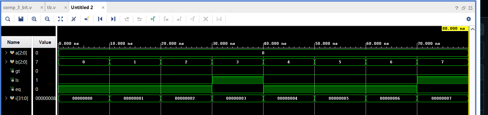
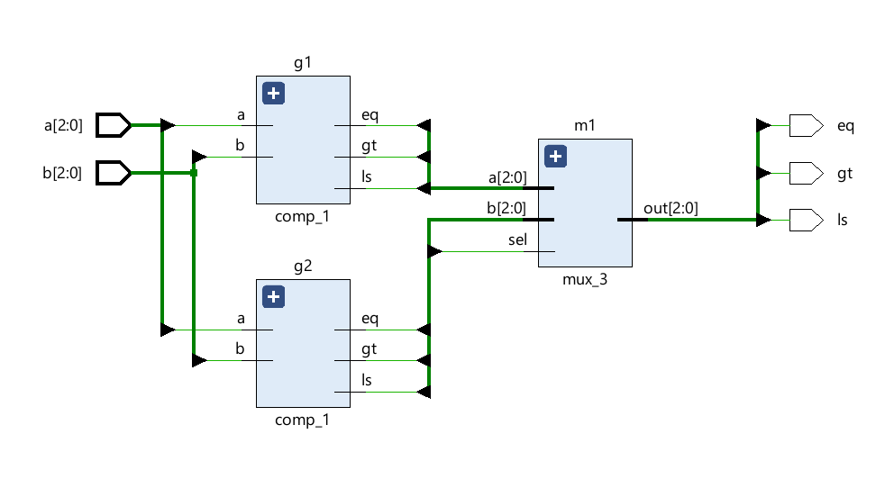

## WaveFrom analysis



## RTL view



# 3-Bit Magnitude Comparator (SystemVerilog)

## Overview

This project implements a **3-bit Magnitude Comparator** in SystemVerilog. The comparator compares two 3-bit binary numbers (`a` and `b`) and generates one of three outputs:

- **gt** = 1 if `a > b`
- **ls** = 1 if `a < b`
- **eq** = 1 if `a == b`

Only one output is asserted (`1`) at a time.

---

## Truth Table

| Condition | gt | ls | eq |
|:---------:|:--:|:--:|:--:|
| a > b | 1 | 0 | 0 |
| a < b | 0 | 1 | 0 |
| a == b | 0 | 0 | 1 |

---

## Simulation Tool

- **Language:** SystemVerilog
- **Simulator:** Cadence Xcelium

---

## Simulation Output

```text
Loading snapshot worklib.tb:sv .................... Done
xcelium> source /xcelium25.03/tools/xcelium/files/xmsimrc
xcelium> run

a=000||b=000||gt=0||ls=0||eq=1
a=000||b=001||gt=0||ls=1||eq=0
a=000||b=010||gt=0||ls=1||eq=0
a=000||b=011||gt=0||ls=1||eq=0
a=001||b=000||gt=1||ls=0||eq=0
a=001||b=001||gt=0||ls=0||eq=1
a=001||b=010||gt=0||ls=1||eq=0
a=001||b=011||gt=0||ls=1||eq=0

xmsim: *W,RNQUIE: Simulation is complete.
xcelium> exit
```

---

## Verification Results

| a | b | Expected | Result |
|:-:|:-:|:--------:|:------:|
|000|000|eq=1|✅ Pass|
|000|001|ls=1|✅ Pass|
|000|010|ls=1|✅ Pass|
|000|011|ls=1|✅ Pass|
|001|000|gt=1|✅ Pass|
|001|001|eq=1|✅ Pass|
|001|010|ls=1|✅ Pass|
|001|011|ls=1|✅ Pass|

---

## Features

- Compares two 3-bit binary numbers.
- Produces mutually exclusive outputs (`gt`, `ls`, or `eq`).
- Verified using a SystemVerilog testbench.
- Simulated successfully with Cadence Xcelium.

---

## Future Work

- Verify all **64 input combinations (8 × 8)**.
- Add assertions for automatic result checking.
- Generate waveform (`.vcd`) for timing analysis.

---

## Status

**Project Status:** ✅ Functional (Verified for the tested input combinations)

---

## Author

**Rajesh**
