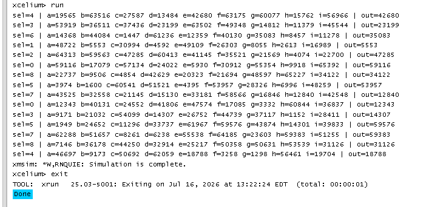

## 

# 9:1 Multiplexer Verification using SystemVerilog

## Project Overview

This project verifies a **16-bit 9:1 Multiplexer** using a simple **SystemVerilog constrained-random testbench**. The verification environment utilizes a **virtual interface** and a **transaction class** to generate and apply randomized test vectors to the Design Under Test (DUT).

---

## Design Specification

| Parameter | Description |
|-----------|-------------|
| Design | 9:1 Multiplexer |
| Input Width | 16-bit |
| Number of Inputs | 9 (a to i) |
| Select Width | 4-bit |
| Output Width | 16-bit |

### Multiplexer Function

The output depends on the value of `sel`.

| sel | Output |
|-----|--------|
| 0 | a |
| 1 | b |
| 2 | c |
| 3 | d |
| 4 | e |
| 5 | f |
| 6 | g |
| 7 | h |
| 8 | i |

---

# Verification Environment

The verification environment consists of the following components:

- Interface
- Virtual Interface
- Transaction Class
- Randomization
- Driver Task
- DUT
- Simulation Output

---

## Interface

The interface connects the testbench with the DUT.

```systemverilog
interface inff;
    logic [15:0] a,b,c,d,e,f,g,h,i;
    logic [3:0] sel;
    logic [15:0] out;
endinterface
```

---

## Transaction Class

The transaction class performs the following tasks:

- Generates randomized input data
- Generates randomized select signal
- Constrains select value from 0 to 8
- Drives randomized values to the interface

Constraint used:

```systemverilog
constraint set_sel {
    sel inside {[0:8]};
}
```

---

# Verification Flow

```
Randomize Inputs
        │
        ▼
Transaction Class
        │
        ▼
Drive Interface Signals
        │
        ▼
9:1 Multiplexer DUT
        │
        ▼
Observe Output
        │
        ▼
Display Results
```

---

# Test Flow

1. Instantiate the interface.
2. Instantiate the DUT.
3. Create the transaction object.
4. Randomize all inputs.
5. Apply randomized values using the `drive()` task.
6. Wait for one simulation time unit.
7. Display the selected input and output.
8. Repeat for 15 randomized test cases.

---

# Sample Simulation Output

```
sel=4
a=19565 b=63516 c=27587 d=13484 e=42680 f=63175 g=60077 h=15762 i=56966
out=42680

sel=7
a=62288 b=51657 c=8261 d=6238 e=5538 f=64185 g=23603 h=59383 i=51255
out=59383

sel=8
a=7146 b=36178 c=44250 d=32914 e=25217 f=50358 g=50631 h=53539 i=31126
out=31126
```

---

# Output Analysis

### Test Case 1

```
sel = 4
```

Selected Input:

```
e = 42680
```

Output:

```
out = 42680
```

Result:

✅ PASS

---

### Test Case 2

```
sel = 7
```

Selected Input:

```
h = 59383
```

Output:

```
out = 59383
```

Result:

✅ PASS

---

### Test Case 3

```
sel = 8
```

Selected Input:

```
i = 31126
```

Output:

```
out = 31126
```

Result:

✅ PASS

---

# Observations

- Successfully generated constrained-random inputs.
- The select signal remained within the valid range (0–8).
- The DUT correctly forwarded the selected input to the output.
- Fifteen randomized test cases were executed successfully.
- No randomization failures occurred.

---

# Features

- 16-bit Data Width
- 9 Input Multiplexer
- Constrained Random Verification
- Virtual Interface
- Transaction-Based Testbench
- Randomized Test Generation
- Simple Driver Implementation

---

# Future Improvements

- Add automatic PASS/FAIL checking.
- Implement a Monitor.
- Implement a Scoreboard.
- Add Functional Coverage.
- Use Mailboxes for communication.
- Build a complete UVM-style verification environment.

---

# Tools Used

- SystemVerilog
- Cadence Xcelium
- Constrained Random Verification

---

# Conclusion

The verification environment successfully tested the **16-bit 9:1 Multiplexer** using constrained-random stimulus. The randomized inputs and constrained select signal verified that the DUT correctly routed the selected input to the output. The project demonstrates the use of **virtual interfaces**, **transaction classes**, and **basic constrained-random verification techniques**, providing a strong foundation for more advanced verification methodologies such as monitor-based environments and UVM.