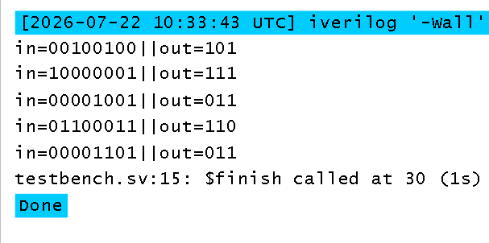
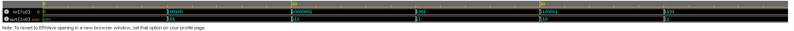

## simulator display



## waveform for periority encoder



# Priority Encoder in Verilog

## 📌 Overview
A **Priority Encoder** is a combinational circuit that converts multiple input lines into a binary output. If more than one input is HIGH (`1`), the encoder gives priority to the **highest-order input**.

For example, in a **4:2 Priority Encoder**:

- `in[3]` has the highest priority.
- `in[0]` has the lowest priority.

---

## 📂 Files

- `priority_encoder.v` → Verilog design
- `priority_encoder_tb.v` → Testbench
- `README.md` → Project documentation

---

## 🛠️ Truth Table

| Input (in[3:0]) | Output (out[1:0]) | Valid |
|-----------------|-------------------|-------|
| 0000 | 00 | 0 |
| 0001 | 00 | 1 |
| 0010 | 01 | 1 |
| 0011 | 01 | 1 |
| 0100 | 10 | 1 |
| 0110 | 10 | 1 |
| 0111 | 10 | 1 |
| 1000 | 11 | 1 |
| 1010 | 11 | 1 |
| 1111 | 11 | 1 |

> The highest-priority input determines the output.

---

## ⚙️ Working Principle

The encoder continuously checks the inputs from the highest priority to the lowest.

Priority Order:

```
in[3] > in[2] > in[1] > in[0]
```

Example:

```
Input = 0110

in[3] = 0
in[2] = 1   ← Highest active input
in[1] = 1
in[0] = 0

Output = 10
```

Although `in[1]` is also HIGH, it is ignored because `in[2]` has higher priority.

---

## 📸 Simulation Result

The waveform verifies that:

- Highest-priority input is selected.
- Output changes according to the active highest input.
- Lower-priority inputs are ignored whenever a higher-priority input is HIGH.

---

## ▶️ Simulation

Compile:

```bash
iverilog priority_encoder.v priority_encoder_tb.v
```

Run:

```bash
vvp a.out
```

Open waveform:

```bash
gtkwave priority_encoder.vcd
```

---

## 📖 Applications

- Interrupt Controllers
- Keyboard Encoding
- Bus Arbitration
- Processor Interrupt Handling
- Memory Address Selection

---

## 🎯 Learning Outcomes

After completing this project, you will understand:

- Combinational circuit design
- Priority logic
- Conditional statements (`if-else`)
- Testbench writing
- Waveform analysis
- Simulation using Verilog

---

## 👨‍💻 Author

**Rajesh**

RTL Design & Verification Enthusiast

```

This README is suitable for uploading to GitHub along with your Verilog priority encoder project.